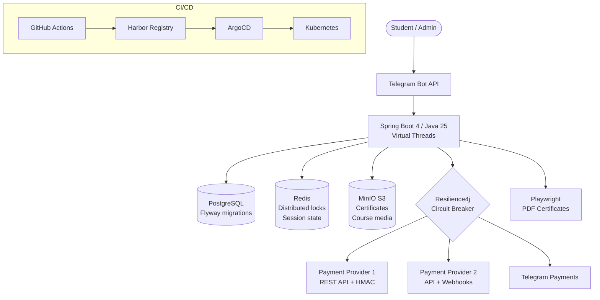

# Online Education & Certification Platform

**Client:** NDA client (freelance)
**Role:** Backend developer, full cycle (requirements gathering with client → architecture → development → deployment)
**Duration:** 6 months
**Status:** Production (2 live instances serving paying customers)

---

## Problem

Client needed a scalable online learning platform with courses, tests, and automated certification. Three critical requirements:

1. **Multi-provider payments** — client wanted redundancy across 3 payment gateways with fiscal compliance (national law requires real-time receipt generation)
2. **Cost reduction** — existing market solutions charged students $500–600 per course, limiting the addressable market
3. **Zero-downtime payments** — any payment failure means lost revenue and lost trust

## Solution

Built a Telegram-based learning platform from scratch on Spring Boot 4 / Java 25:

**Core Architecture:**
- Virtual Threads (`spring.threads.virtual.enabled=true`) for high-concurrency request handling without thread pool tuning
- PostgreSQL with Flyway migrations for course/user/payment data
- Redis for distributed locking (payment idempotency), session state, and TTL-based caching
- MinIO (S3-compatible) for media storage with presigned URLs (certificates, course materials)

**Payment Engine (66 Java files):**
- Triple integration: 2 regional payment gateways (comparable to Stripe/PayPal) + Telegram Payments — each with REST API, HMAC signature verification, and webhook processing
- Fiscal compliance: `Receipt` / `GatewayReceipt` / `ReceiptItem` models, tax scheme integration, payment object type: "service"
- Resilience4j Circuit Breaker with separate read/write policies — payment writes have stricter thresholds than read operations
- Retry with exponential backoff for transient failures

**Quality & Operations:**
- TestContainers for integration tests against real PostgreSQL/Redis/MinIO
- PDF certificate generation via Playwright (HTML → PDF rendering)
- Audit logging — full history of personal data changes with admin tracking
- CI/CD: GitHub Actions → Harbor (SHA + git-describe tags) → ArgoCD (GitOps, Kustomize overlays)

## Result

| Metric | Value |
|--------|-------|
| Production instances | **2** (learn.arcanespectrum.ru, learn.domhair.ru) |
| Sales impact | **10x increase** — course prices dropped from $500–600 to $80–130 |
| Codebase | **58,604** Java LOC, **657** files, **104** test files (39K test LOC) |
| Payment uptime | **Zero processing failures** since launch (Circuit Breaker + retry) |
| Deployment | Zero-touch via ArgoCD GitOps |

## Architecture

## Tech Stack

`Spring Boot 4` `Java 25` `Virtual Threads` `PostgreSQL` `Redis` `MinIO (S3)` `Payment Gateway Integration (3 providers)` `Telegram Payments` `Flyway` `Resilience4j` `TestContainers` `Playwright` `Docker` `GitHub Actions` `ArgoCD` `Kustomize`
