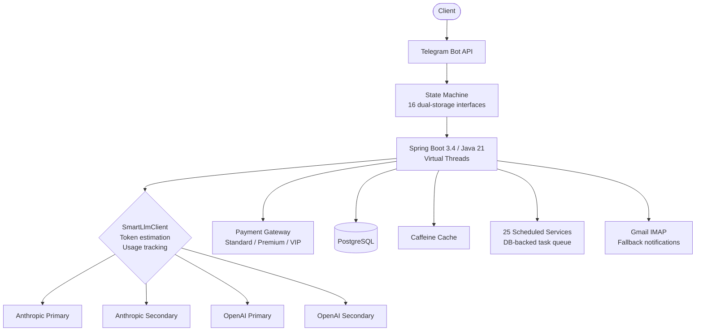

# AI-Powered B2C Subscription Platform

**Client:** NDA client (freelance)
**Role:** Backend developer, full cycle
**Duration:** 10 months
**Status:** Production

---

## Problem

Client operated a B2C service with three pain points:

1. **Manual appointment booking** — every request required human processing, limiting throughput to staff availability
2. **Spam flood** — high volume of irrelevant messages buried real customer requests
3. **No subscription monetization** — client wanted tiered access (Standard/Premium/VIP) but had no payment infrastructure

## Solution

Built a Telegram-based backend with dual AI integration:

**AI Layer (4 LLM configurations):**
- Dual Anthropic (primary + secondary) + dual OpenAI (primary + secondary) — automatic failover between providers
- SmartLlmClient with token estimation, usage tracking (in-memory + DB dual storage), and cost monitoring
- Automated draft response generation — AI prepares answers, human reviews and sends
- Spam classification — AI filters irrelevant messages before they reach the operator

**Subscription Engine (74+ payment files):**
- Regional payment gateway (comparable to Stripe) with 3 subscription tiers (Standard/Premium/VIP)
- Fiscal compliance (same as education platform, proven pattern)
- Subscription lifecycle management: trial → active → renewal → expiry → grace period

**Architecture:**
- State machine for complex multi-step user workflows
- 16 dual-storage interfaces (hot + cold data separation)
- 25 scheduled background services with DB-backed task queue
- Rate limiter to prevent API abuse
- Booking system with conflict detection
- Admin panel for content and user management
- Gmail IMAP fallback for notification delivery when Telegram is unreachable
- Caffeine local cache + OpenFeign for service communication

**Documentation:**
- 8 Mermaid architectural diagrams (state flows, payment sequences, data models)

## Result

| Metric | Value |
|--------|-------|
| Spam handling | **100% automated** — eliminated ~200 spam messages/day from manual review |
| Booking | Fully automated — clients self-schedule without operator involvement |
| Operator workload | Reduced by ~70% — AI handles drafts, spam, and scheduling |
| Codebase | **57,375** Java LOC, **596** files, **28** entities |
| Scheduled services | **25** background jobs (task queue, notifications, cleanup, sync) |
| Architecture docs | **8** Mermaid diagrams |

## Architecture

## Tech Stack

`Spring Boot 3.4` `Java 21` `Virtual Threads` `Spring AI` `Claude API` `OpenAI API` `Anthropic SDK` `Payment Gateway Integration` `PostgreSQL` `Flyway` `Caffeine` `OpenFeign` `Resilience4j` `Telegram Bot API` `Gmail IMAP` `Docker`
