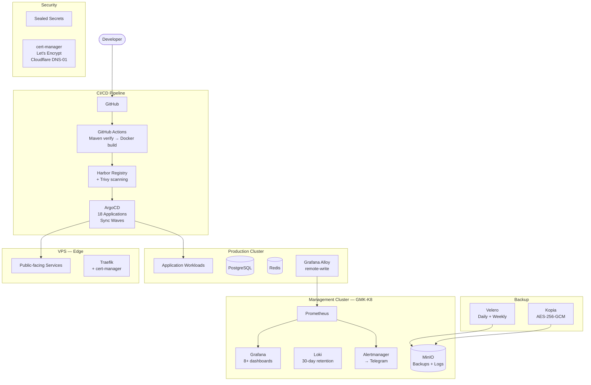

# GitOps Kubernetes Infrastructure

**Client:** Own infrastructure for client projects
**Role:** DevOps engineer
**Duration:** Ongoing (6+ months)
**Status:** Production

---

## Problem

Multiple production services (education platforms, bots, APIs) needed:

1. **Reproducible deployments** — manual `docker-compose up` doesn't scale and has no rollback
2. **Multi-environment management** — development, staging, production across different clusters
3. **Observability** — no monitoring, no alerting, no centralized logging. Failures discovered by users
4. **Security** — secrets in plaintext, no vulnerability scanning, manual certificate management
5. **Disaster recovery** — no automated backups, no tested recovery procedure

## Solution

Built a complete GitOps infrastructure from scratch:

**Cluster Architecture (3 K8s clusters):**
- **GMK-K8** (management): ArgoCD, Harbor + Trivy, MinIO, Loki, Prometheus, Grafana, Alertmanager
- **k8s-assessment** (production): PostgreSQL, Redis, MinIO, application workloads
- **arcane** (VPS): edge deployment for public-facing services
- All clusters run K3s in Docker for resource efficiency

**GitOps Pipeline:**
- ArgoCD with ApplicationSets and sync waves for ordered deployment
- Kustomize overlays for environment-specific configuration
- GitHub Actions: Maven verify → multi-stage Docker build → Harbor push (SHA + git-describe tags) → Kustomize image update → ArgoCD auto-sync

**Monitoring & Alerting:**
- Prometheus with remote-write from production clusters (via Grafana Alloy)
- 8+ Grafana dashboards: Node Exporter, Traefik, PostgreSQL, Redis, MinIO, JVM/Micrometer, Spring Boot
- Alertmanager with severity-based routing: Critical (10s) / Warning (5m) → Telegram notifications
- Loki for centralized logging (30-day retention, MinIO backend, 10 MB/s ingestion)

**Security:**
- Harbor + Trivy for container vulnerability scanning
- Sealed Secrets (Bitnami) for encrypted credentials in Git
- cert-manager + Let's Encrypt + Cloudflare DNS-01 for automated TLS (wildcard certificates)
- SSH hardening via Ansible playbooks

**Backup & DR:**
- Velero: daily backups (3:00 UTC, 30-day retention) + weekly (4:00 UTC, 90-day retention)
- Kopia with AES-256-GCM encryption before upload to MinIO (50 GB)
- Tested recovery procedure documented

**Automation:**
- 8 Ansible playbooks: VPS setup, K3s updates, SSH hardening, security patches, and more
- Renovate Bot for automated Helm chart updates (weekly, grouped)
- Kured for automatic node reboots (maintenance window 01:00–03:00, graceful pod eviction)

## Result

| Metric | Value |
|--------|-------|
| Deployment model | **Zero-touch** — git push triggers full pipeline |
| ArgoCD | **18** Applications, **23** Kustomize overlays, **24** Helm value files |
| Monitoring | **8+ dashboards** covering all infrastructure layers |
| Alert response | Critical: **10 seconds**, Warning: **5 minutes** |
| Backup | Automated daily + weekly, **AES-256-GCM** encrypted |
| Certificate management | Fully automated (Let's Encrypt + Cloudflare DNS-01) |
| Vulnerability scanning | Every image scanned on push (Harbor + Trivy) |
| Dependency updates | Automated weekly via Renovate Bot |
| Infrastructure as Code | **155** YAML files, **8** Ansible playbooks |

## Architecture

## Tech Stack

`Kubernetes (K3s)` `ArgoCD` `Helm` `Kustomize` `Harbor` `Trivy` `Sealed Secrets` `Velero` `Kopia` `Prometheus` `Grafana` `Loki` `Alertmanager` `Grafana Alloy` `cert-manager` `Let's Encrypt` `Cloudflare` `Traefik` `Ansible` `Renovate Bot` `Kured` `GitHub Actions` `Docker`
