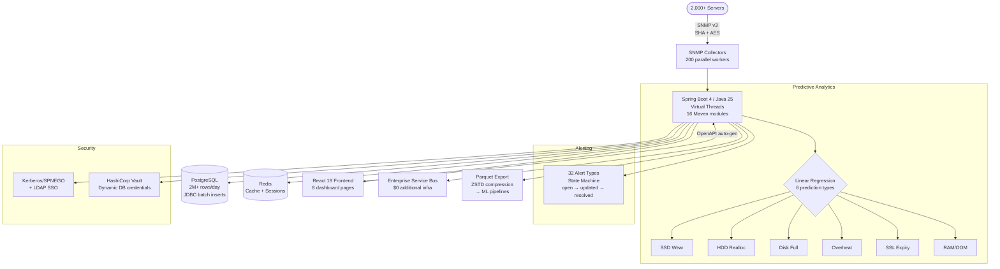

# Server Fleet Monitoring & Predictive Analytics Platform

**Client:** NDA client (Fortune 500 energy company subsidiary)
**Role:** Developer (backend + frontend). Deployment to corporate network handled by company DevOps team
**Duration:** 4+ months (active development)
**Status:** Production

---

## Problem

2,000+ servers across a nationwide network of remote service locations had **zero monitoring**:

1. **No visibility** — disk failures, memory issues, and hardware degradation discovered only after causing downtime
2. **No dedicated monitoring infra** — deploying Zabbix/Nagios across 2,000+ sites was not feasible (budget, network constraints)
3. **Reactive maintenance** — every failure was an emergency, with no ability to predict or prevent
4. **No disk lifecycle tracking** — SSDs wearing out silently, HDDs developing bad sectors undetected

## Solution

Built a predictive monitoring platform that leverages the existing Enterprise Service Bus — no new infrastructure deployment needed:

**Backend Architecture (16-module Maven modular monolith):**
- Spring Boot 4, Java 25, Virtual Threads
- Loosely coupled modules: `fleet-kernel` → `fleet-schema` → `fleet-persistence` → `fleet-monitoring` → `fleet-snmp` → `fleet-collection` → `fleet-disk` → `fleet-endurance` → `fleet-alert` → `fleet-analysis` → `fleet-dashboard` → `fleet-ops` → `fleet-web` → `fleet-app` + `fleet-test-support` + `fleet-esb`
- No cross-module JPA foreign keys — IDs passed as primitives for loose coupling
- JDBC batch inserts (StatelessBulkWriter) for high-volume metric ingestion — ORM overhead unacceptable at 2M rows/day

**SNMP Metric Collection:**
- SNMP v3 (authPriv: SHA + AES encryption) via SNMP4J — 200 parallel collectors
- Standard OIDs (CPU, RAM, swap, load, network, disk) + custom extend scripts (SSL expiry, replication status, backup age)
- SSRF protection: hostname validated against allowed CIDRs, loopback/link-local blocked
- Fallback: hostname → IP resolution with retry on first failure
- 5-minute poll interval, full fleet scan in ~10 minutes

**Predictive Analytics (Linear Regression):**
- **SSD wear prediction** — extrapolate wear decline → months until failure (CRITICAL <2mo, WARNING <6mo)
- **HDD reallocation tracking** — sector reallocation rate with threshold alerting
- **Disk full forecast** — when partition hits 100% (30-day horizon)
- **Overheat prediction** — temperature trending toward critical threshold (90-day horizon)
- **SSL certificate expiry** — countdown alerting (CRITICAL <7 days, WARNING <30 days)
- **RAM/OOM prediction** — memory usage trending toward exhaustion (14-day horizon)
- Trend detection with 24-sample moving average smoothing, systemic issue identification across fleet

**Alerting System (32 alert types):**
- Resource: CPU, RAM, swap, I/O wait, load, disk I/O, disk space
- Hardware: CPU/NVMe temperature, GPU errors, UDMA CRC, lockups, reboots
- SMART: SSD wear, HDD realloc, unsafe shutdowns, power cycles
- Services: SSL cert expiry, replication lag, backup age, RAID status
- System: OOM kills, dmesg errors, pstore crashes, zombie processes
- State machine: open → updated → resolved, with optimistic locking

**Security & Enterprise Integration:**
- Spring Security: Kerberos/SPNEGO + LDAP (Active Directory SSO)
- 4-tier RBAC: dashboard (read) / export (ML data) / write (manage hosts) / admin (retention ops)
- HashiCorp Vault integration for dynamic DB credential rotation (AppRole auth)
- Keytab validation at startup (POSIX permissions check, fail-fast)
- Audit logging for all destructive operations

**Data Retention Management:**
- 3-tier response: WARNING (30GB) → CRITICAL (15GB, auto-cleanup) → FATAL (5GB, skip snapshots)
- Configurable retention (90 days default), batch deletion (288 snapshots/batch)
- Emergency cleanup endpoint for manual intervention

**Frontend (React 19):**
- TypeScript, TanStack React Query, React Hook Form + Zod validation
- 8 pages: Fleet dashboard, Disks, Analysis, Endurance DB, Targets, Retention, Errors, Export
- API client auto-generated from OpenAPI spec via openapi-ts
- Parquet export with ZSTD compression for ML pipelines

**Code Quality:**
- CheckStyle, PMD, Error Prone (compiler plugin), Spotless (import ordering)
- ArchUnit for architecture boundary enforcement
- N+1 query detection (Hypersistence Utils SQLStatementCountValidator)
- TestContainers (PostgreSQL, Redis) for integration tests

## Result

| Metric | Value |
|--------|-------|
| Coverage | **2,000+ hosts** — from zero to full visibility |
| Codebase | **83,198** Java LOC, **824** files, **16** Maven modules |
| Data volume | **2M+ metric rows/day**, 10K disk records/snapshot |
| Alert types | **32** covering hardware, SMART, services, OS |
| Collection | **200** parallel SNMP workers, full fleet in ~10 min |
| Predictions | **6** types: SSD wear, HDD realloc, disk full, overheat, SSL, RAM |
| Infrastructure cost | **$0 additional** — uses existing Enterprise Service Bus |
| Frontend | **8** dashboard pages, auto-generated API client |

## Architecture

## Tech Stack

`Spring Boot 4` `Java 25` `Virtual Threads` `PostgreSQL` `Redis` `SNMP4J (SNMPv3)` `Spring Security (Kerberos/SPNEGO + LDAP)` `HashiCorp Vault` `MapStruct` `Springdoc-OpenAPI` `Flyway` `TestContainers` `ArchUnit` `CheckStyle` `PMD` `Error Prone` `React 19` `TypeScript` `TanStack React Query` `Zod` `Vite` `Maven (16 modules)` `Docker`
