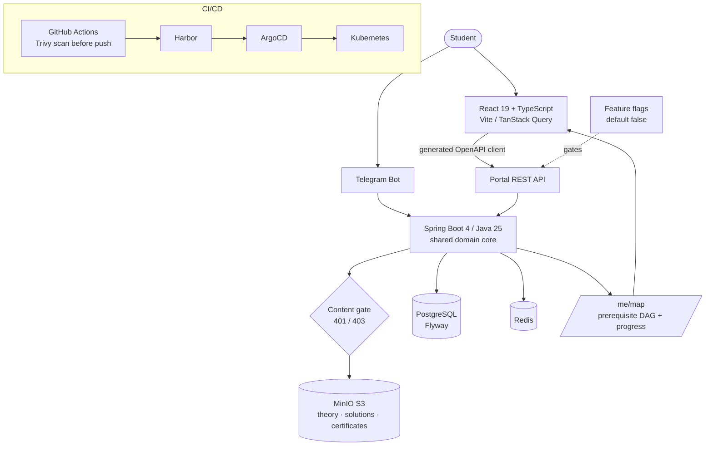

# Web Learning Portal & Progress-Map Mini App

**Client:** NDA client (freelance)
**Role:** Full-cycle — backend extension, frontend application, deployment
**Status:** Production ([neurovektor.ru](https://neurovektor.ru/) — 37 courses live)

---

## Problem

The client had a working Telegram-only learning platform (see [case 01](01-online-education-platform.md)) serving two paying instances. A third client needed something the bot could not give:

1. **A web product, not a chat** — long-form theory, worked solutions and a visible learning route don't fit into a message thread
2. **A route, not a course list** — 37 math courses leading to one goal ("foundation of an AI engineer"); students needed to see what unlocks what, where they are, and what's next
3. **No regression for the two live instances** — the existing production deployments had to keep behaving exactly as before while the new surface was built on the same codebase

## Solution

Extended the existing backend and built a new frontend against it.

**Backend — new portal layer on the same core:**
- Portal REST API alongside the bot: catalog, course, attempt, purchase, theory and `GET /me/map` endpoints — the bot and the web share one domain model, not two
- Cross-login: student authenticates on the web with a code issued by the bot — one identity across both surfaces
- Content gate: paid theory and worked solutions are served only to buyers; unauthorized requests get `401`, unpaid ones `403` — enforced server-side, not by hiding UI
- Public certificate verification by QR (`/cert/:num`) — open endpoint, no auth
- **Everything shipped behind feature flags, defaulting to `false`** (`web-learning`, `bundles`, `access-revocation`, `reset-queue`). Merging to main and exposing to users are separate moves; the two existing instances ran the new code with the flags off

**Frontend — thin renderer, backend is the authority:**
- All state logic (what's unlocked, % complete, "you are here", next milestone, totals) is computed on the backend and delivered as one `MapModel` over a single endpoint. The frontend lays out the graph and draws it — no duplicated business rules
- Prerequisite DAG rendered as an interactive SVG map: tiers, domains, drill-down into modules, camera pan/zoom
- Contract-first: the OpenAPI spec is pulled from the backend build and the typed client is code-generated — the frontend cannot drift from the API
- Accessibility and delivery details: Okabe-Ito colorblind-safe palette, dual light/dark theme applied before first paint (no flash), self-hosted fonts (no external font fetch, CSP-clean)
- Full commercial surface: offer, privacy, consent, cookies, returns and contacts pages

**Delivery:**
- Frontend containerized behind nginx, GitHub Actions pipeline with a Trivy image scan **before** push — a green build means it actually deploys
- Deployed onto the same GitOps infrastructure as the rest of the fleet

## Result

| Metric | Value |
|--------|-------|
| Product live | **[neurovektor.ru](https://neurovektor.ru/)** — 37 courses, tests with worked solutions |
| Existing instances affected | **Zero** — new surface shipped dark behind feature flags |
| Frontend codebase | **10,177** LOC across **67** files (TypeScript/React) |
| API drift | **Structurally impossible** — client generated from the backend's own OpenAPI spec |
| Backend growth | Portal layer added to the same codebase (totals in [case 01](01-online-education-platform.md)) |

## Architecture

## Tech Stack

`Spring Boot 4` `Java 25` `PostgreSQL` `Redis` `MinIO (S3)` `Feature flags` `OpenAPI / springdoc` `React 19` `TypeScript` `Vite` `TanStack Query` `React Router` `Zod` `Vitest` `SVG graph rendering` `nginx` `Docker` `GitHub Actions` `Trivy` `ArgoCD`
